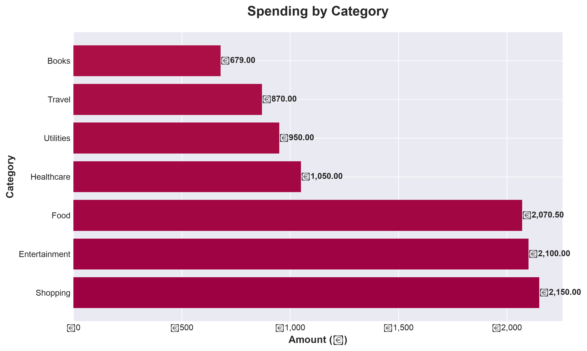
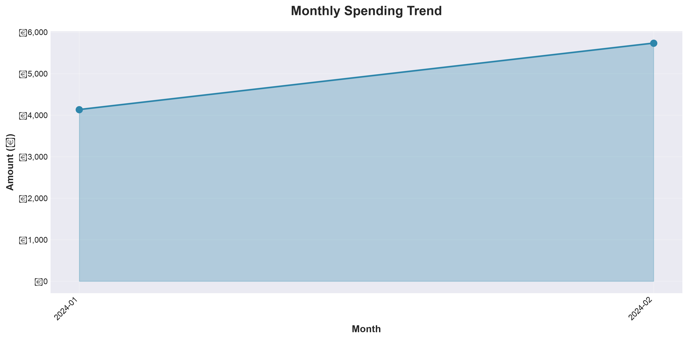
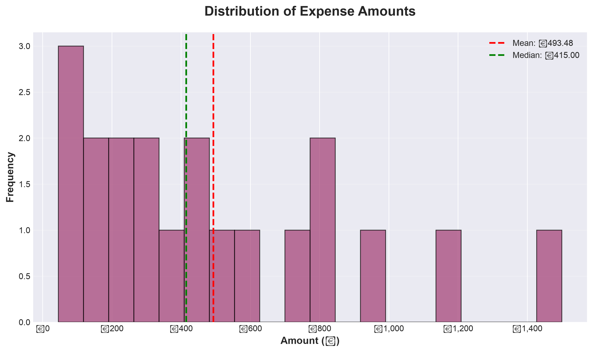
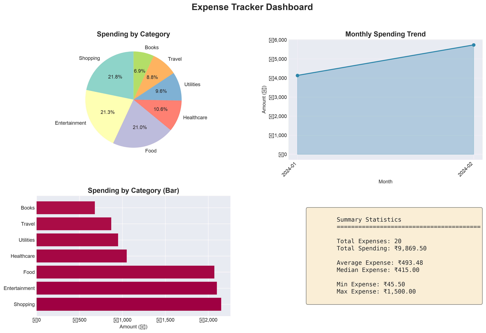

# Expense Tracker

A Python-based expense tracking application with SQLite database, pandas analytics, and data visualization.

## Features

- **SQLite Database** - Persistent storage with SQL queries and indexing
- **Pandas Analytics** - Data analysis with groupby, aggregations, and statistical functions
- **Data Visualization** - Charts and dashboards using Matplotlib
- **ETL Pipeline** - Import bank statements from CSV with data transformation
- **Input Validation** - Robust error handling and data validation
- **Logging** - Professional logging instead of print statements

## Tech Stack

| Layer | Technology | Purpose |
|-------|-----------|---------|
| **Language** | Python 3.8+ | Core programming language |
| **Database** | SQLite3 (stdlib) | Local persistent storage with SQL queries and indexes |
| **Data Analysis** | pandas | Data aggregation, groupby operations, summary statistics |
| **Visualization** | matplotlib | Charts, graphs, and dashboards (PNG output) |
| **ETL** | csv (stdlib) | Extract-Transform-Load pipeline for bank statement imports |
| **Data Modeling** | dataclasses, typing (stdlib) | Structured data validation with type hints |
| **Logging** | logging (stdlib) | Structured status and error logging |
| **Interface** | Interactive CLI | Menu-driven terminal application (input/print loop) |
| **Version Control** | Git/GitHub | Repository hosting and collaboration |

**Dependencies**: Only 2 external packages required (`pandas`, `matplotlib`) - everything else uses Python standard library.

## Quick Start

### Installation

```bash
# Clone the repository
git clone https://github.com/sulekha4s/expense-tracker.git
cd expense-tracker

# Create virtual environment
python3 -m venv venv
source venv/bin/activate  # On Windows: venv\Scripts\activate

# Install dependencies
pip install -r requirements.txt
```

### Running the Application

```bash
# Run the interactive menu application
python main.py
```

The application presents an interactive menu with the following options:

```
================================
      EXPENSE TRACKER MENU
================================
1.  Add Expense
2.  View All Expenses
3.  View Total Spending
4.  View Expenses by Category
5.  Delete an Expense
6.  View Analytics Dashboard
7.  View Spending by Category (Detailed)
8.  View Monthly Trend
9.  Generate Charts
10. Export to CSV
11. Load Sample Data (ETL Demo)
12. Exit
================================
```

Simply enter the number corresponding to your desired action and follow the prompts.

## Project Structure

```
expense-tracker/
├── src/
│   └── expense_tracker/
│       ├── __init__.py
│       ├── models.py          # Expense data model with validation
│       ├── database.py        # SQLite database operations
│       ├── analysis.py        # Pandas-based analytics
│       ├── visualization.py   # Matplotlib charts
│       ├── etl.py             # CSV import ETL pipeline
│       ├── utils.py           # Utility functions
│       └── main.py            # CLI menu application
├── data/
│   ├── .gitkeep
│   └── sample_bank_statement.csv  # Sample data for ETL testing
├── charts/                    # Generated visualizations (gitignored)
├── main.py                    # Application entry point
├── requirements.txt           # Dependencies
├── .gitignore
├── LICENSE
└── README.md
```

## Usage

### Adding Expenses

From the main menu, select option `1` to add an expense:

```
Enter date (YYYY-MM-DD or DD/MM/YYYY or 'today'): 2024-01-15
Available categories: Books, Entertainment, Food, Other, Shopping, Travel
Enter category: Food
Enter description: Lunch at restaurant
Enter amount (₹): 250.50

✓ Expense added successfully! (ID: 1)
```

### Viewing Analytics

The application provides:
- Total spending summary with statistics
- Spending by category (with percentages)
- Monthly trends
- Top expenses
- Category-wise detailed analysis

### Generating Charts

The application generates:
- Pie chart of spending by category
- Line chart of monthly spending trend
- Bar chart comparisons
- Expense distribution histogram
- Comprehensive dashboard

All charts are saved to the `charts/` directory as high-resolution PNG files.

## Sample Visualizations

The application generates professional visualizations using matplotlib. Below are sample charts generated from the included bank statement data:

### Category Distribution

*Pie chart showing expense distribution across categories*

### Monthly Spending Trend

*Line chart tracking spending patterns over time*

### Expense Distribution

*Histogram showing the distribution of expense amounts*

### Analytics Dashboard

*Comprehensive dashboard with multiple visualizations*

### ETL Pipeline Demo (Loading Sample Data)

The application includes a built-in ETL (Extract-Transform-Load) pipeline demonstration. Select option `11` from the menu to load sample bank statement data:

```
11. Load Sample Data (ETL Demo)
```

**What happens when you select this option:**
1. **Extract**: Reads `data/sample_bank_statement.csv` (20 mock bank transactions)
2. **Transform**: Validates dates, amounts, and categories; skips credit entries
3. **Load**: Inserts validated expenses into the SQLite database

**Sample Data Contents:**
- 20 expense transactions from January-February 2024
- 7 categories: Food, Travel, Books, Shopping, Entertainment, Healthcare, Utilities
- All transactions are valid debits (expenses), no credits (income)

After loading, you can immediately:
- View all 20 expenses (option 2)
- See category breakdowns (option 7)
- Analyze monthly trends for Jan-Feb (option 8)
- Generate charts showing spending patterns (option 9)

**Programmatic Usage:**
You can also import CSV files programmatically:

```python
from src.expense_tracker.etl import BankStatementETL
from src.expense_tracker.database import ExpenseDatabase

db = ExpenseDatabase()
etl = BankStatementETL(db)
stats = etl.run_pipeline("data/sample_bank_statement.csv")

print(f"Imported: {stats['imported']} expenses")
print(f"Skipped: {stats['skipped']} rows")
print(f"Errors: {stats['errors']} rows")
```

## Sample Data

A sample bank statement CSV is provided in `data/sample_bank_statement.csv` for testing the ETL functionality.

CSV Format:
```csv
Transaction Date,Description,Category,Debit,Credit
2024-01-05,Coffee Shop,Food,45.50,
2024-01-07,Grocery Store,Food,320.00,
```

## Analytics Features

### Statistical Analysis
- Total spending
- Average expense
- Median expense
- Min/Max expenses
- Expense counts

### Category Analysis
- Total spending per category
- Average expense per category
- Expense frequency by category
- Category statistics (count, total, mean, min, max)

### Time Series Analysis
- Monthly spending trends
- Expense counts per month
- Average spending per month
- Date range filtering

### Visualizations
- Category pie chart
- Monthly trend line chart
- Category bar chart
- Expense distribution histogram
- Comprehensive dashboard

## Technical Details

### Database Schema

```sql
CREATE TABLE expenses (
    id INTEGER PRIMARY KEY AUTOINCREMENT,
    date TEXT NOT NULL,
    category TEXT NOT NULL,
    description TEXT NOT NULL,
    amount REAL NOT NULL,
    created_at TIMESTAMP DEFAULT CURRENT_TIMESTAMP
);

CREATE INDEX idx_date ON expenses(date);
CREATE INDEX idx_category ON expenses(category);
```

### Data Validation

- Date format validation (YYYY-MM-DD)
- Category whitelist validation
- Positive amount validation
- Non-empty description validation

### Error Handling

- Try-except blocks for all user inputs
- Database transaction safety
- Graceful error messages
- Logging of errors and warnings

## Future Enhancements

- [ ] Command-line arguments (Click/argparse) for non-interactive use
- [ ] Budget tracking and alerts per category
- [ ] Web dashboard with Streamlit
- [ ] Export to Excel/PDF reports
- [ ] Multi-currency support
- [ ] Recurring expense tracking
- [ ] Data backup and restore
- [ ] API integration for automatic bank imports

## License

MIT License

## Contributing

Pull requests are welcome.
